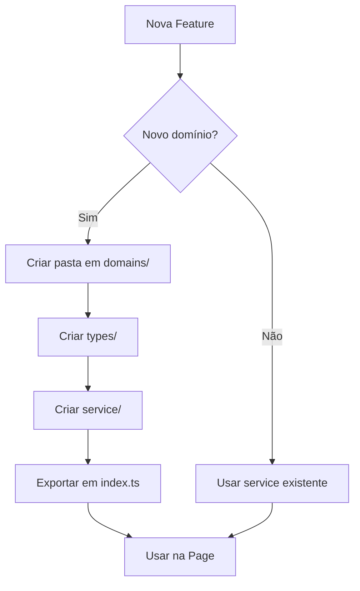

# 📘 ChamadaDiária - Documentação Técnica

## 02 - Arquitetura Técnica

---

## Estrutura de Camadas

```
┌─────────────────────────────────────────────────────────┐
│                      PAGES                               │
│  React components que renderizam UI                     │
│  ❌ NÃO podem acessar Supabase diretamente              │
└───────────────────────┬─────────────────────────────────┘
                        │
                        ▼
┌─────────────────────────────────────────────────────────┐
│                 DOMAIN SERVICES                          │
│  Lógica de negócio encapsulada por domínio              │
│  Única camada autorizada a acessar Supabase             │
└───────────────────────┬─────────────────────────────────┘
                        │
                        ▼
┌─────────────────────────────────────────────────────────┐
│                   SUPABASE                               │
│  PostgreSQL + RLS + Auth + RPCs                         │
└─────────────────────────────────────────────────────────┘
```

---

## Fluxo de Dados: Page → Service → Database

```typescript
// ❌ PROIBIDO (ESLint bloqueia)
const { data } = await supabase.from('alunos').select('*');

// ✅ CORRETO
const alunos = await alunoService.listByTurma(turmaId);
```

### Exemplo Real

```typescript
// Page: AlunoPage.tsx
import { alunoService } from '@/domains';

const AlunoPage = () => {
  const [alunos, setAlunos] = useState([]);
  
  useEffect(() => {
    alunoService.listByTurma(turmaId).then(setAlunos);
  }, [turmaId]);
};

// Service: src/domains/alunos/services/aluno.service.ts
export const alunoService = {
  async listByTurma(turmaId: string) {
    const { data, error } = await supabase
      .from('alunos')
      .select('*')
      .eq('turma_id', turmaId);
    if (error) throw error;
    return data;
  }
};
```

---

## Organização por Domínios

```
src/domains/
├── acesso/          # Convites, permissões
├── alertas/         # Sistema de alertas
├── alunos/          # CRUD de alunos
├── atestados/       # Atestados médicos
├── atrasos/         # Registro de atrasos
├── beneficios/      # Consulta a benefícios
├── chamada/         # Presença diária
├── escola/          # Configuração da escola
├── eventos/         # Gestão de eventos
├── gestor/          # Funções de gestão
├── ingresso/        # Check-in eventos
├── observacoes/     # Observações pedagógicas
├── pesquisas/       # Enquetes
├── portalAluno/     # Portal do estudante
├── programas/       # Programas sociais
├── turmas/          # Gestão de turmas
└── index.ts         # Exportação central
```

### Estrutura de Cada Domínio

```
dominio/
├── types/           # Interfaces TypeScript
│   └── dominio.types.ts
├── services/        # Lógica de negócio
│   └── dominio.service.ts
└── index.ts         # Re-exportação
```

---

## Decisões Arquiteturais

| Decisão | Justificativa |
|---------|---------------|
| **Domain Services** | Isola lógica de negócio, facilita testes, previne vazamento de dados |
| **RLS obrigatório** | Segurança at-rest, mesmo com bug no frontend dados estão protegidos |
| **ESLint bloqueando Supabase** | Força uso de services, consistência arquitetural |
| **React Query** | Cache automático, reduz requisições em 60% |
| **IndexedDB criptografado** | Dados sensíveis offline protegidos |

---

## O que é Permitido vs Proibido

### ✅ Permitido

| Contexto | Ação |
|----------|------|
| Pages | Chamar domain services |
| Pages | Usar React Query hooks |
| Services | Acessar Supabase |
| Services | Chamar RPCs |
| Components | Props drilling ou hooks |

### ❌ Proibido

| Contexto | Ação | Motivo |
|----------|------|--------|
| Pages | `import { supabase }` | ESLint error, quebra isolamento |
| Pages | Queries diretas | Bypass de RLS no código |
| Services | Retornar `supabase` client | Exposição de acesso |
| Components | Lógica de negócio | Responsabilidade errada |

---

## ESLint: Enforcement de Arquitetura

```javascript
// eslint.config.js
{
  files: ['src/pages/**/*.tsx'],
  rules: {
    'no-restricted-imports': ['error', {
      patterns: [{
        group: ['@/integrations/supabase/client'],
        message: 'Pages não podem importar Supabase. Use domain services.'
      }]
    }]
  }
}
```

---

## Fluxo de Adição de Nova Funcionalidade



---

*Anterior: [01 - Visão Geral](./01-visao-geral.md) | Próximo: [03 - Segurança](./03-seguranca.md)*
